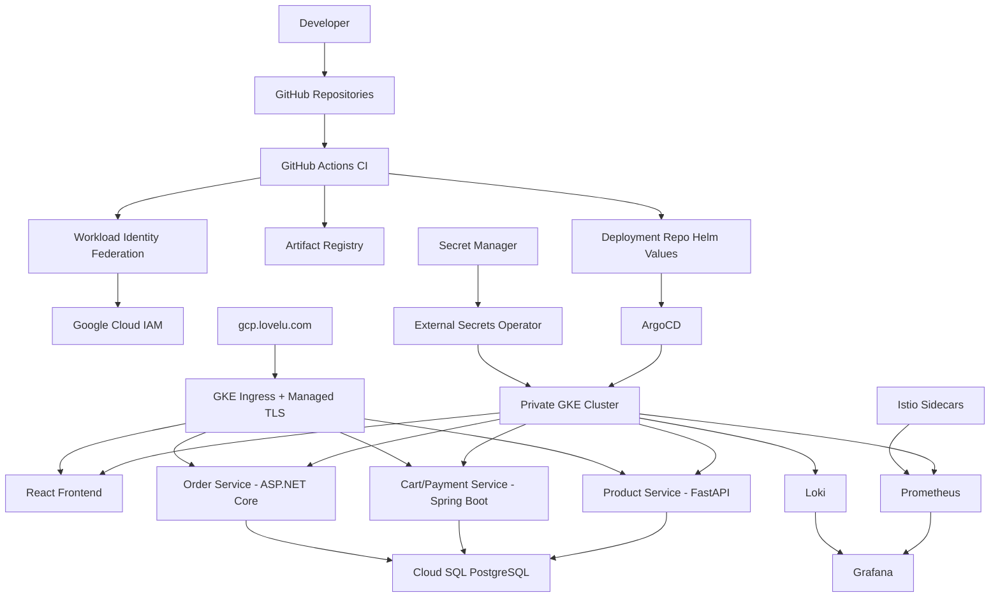
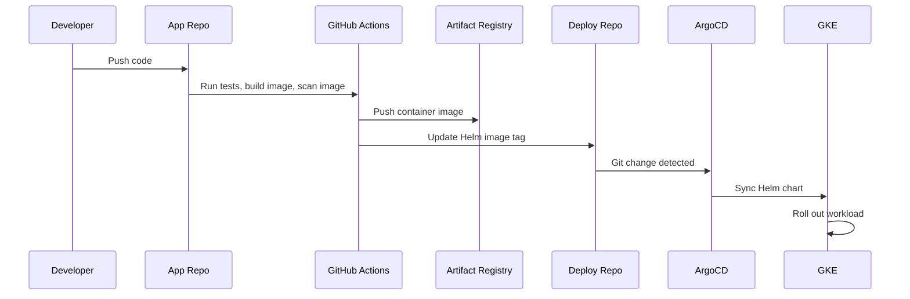

# GCP Golden Path Platform

A production-style DevOps Golden Path for deploying containerized microservices on Google Cloud Platform.

This repository is the platform and deployment repo. It provisions the cloud foundation with Terraform, deploys platform add-ons, and uses ArgoCD + Helm to run a small e-commerce microservices application on GKE.

## What This Showcases

- Private GKE platform built with Terraform
- GitOps deployments with ArgoCD and Helm
- GitHub Actions OIDC authentication using Workload Identity Federation
- Artifact Registry image publishing
- Cloud SQL PostgreSQL with app-owned schemas
- Secret Manager integration through External Secrets Operator
- HTTPS with GKE ManagedCertificate
- Prometheus, Grafana, Loki, and Promtail observability
- Istio sidecar injection, mTLS policy, and telemetry scraping
- Kubernetes HPA and NetworkPolicy controls
- Multi-repo application delivery model

## Architecture



Detailed architecture notes live in [docs/architecture.md](docs/architecture.md).

## Repository Layout

```text
.
├── argocd/                 # ArgoCD Application definitions
├── docs/                   # Architecture and operations documentation
├── helm-charts/            # Service Helm charts and environment values
├── platform/               # Monitoring, logging, and Istio platform manifests
├── rendered-manifests/     # Rendered Kubernetes manifest snapshot
└── terraform/              # GCP infrastructure and platform add-on modules
```

## Related Application Repositories

This Golden Path uses separate app repos so each service can own its source code, tests, Dockerfile, and CI workflow:

| Repo | Runtime | Responsibility |
| --- | --- | --- |
| `ecommerce-product-service` | Python FastAPI | Product catalog API |
| `ecommerce-frontend` | React + Vite | Customer storefront |
| `cart-payment-service` | Java Spring Boot | Cart and mock payment API |
| `order-service` | ASP.NET Core | Order creation and order history API |

Terraform stays in this repo because it manages shared infrastructure, IAM, cluster add-ons, and GitOps application wiring.

## Platform Components

| Layer | Tooling |
| --- | --- |
| Infrastructure | Terraform, VPC, private GKE, Artifact Registry, Cloud SQL, Secret Manager |
| Identity | IAM service accounts, Workload Identity, GitHub OIDC |
| Delivery | Docker, GitHub Actions, Helm, ArgoCD |
| Runtime | GKE, HPA, NetworkPolicy, GKE Ingress, ManagedCertificate |
| Secrets | Google Secret Manager, External Secrets Operator |
| Observability | Prometheus, Grafana, Loki, Promtail, Istio telemetry |
| Service Mesh | Istio sidecar injection, PeerAuthentication, DestinationRule, Telemetry |

## Deployment Flow



## Rebuild From Zero

From `terraform/envs/dev`:

```bash
terraform init

terraform apply \
  -var="project_id=YOUR_PROJECT_ID" \
  -var="enable_cloud_sql=true" \
  -var="enable_platform_addons=true" \
  -var="grafana_admin_password=REPLACE_WITH_STRONG_PASSWORD" \
  -var='master_authorized_cidr_blocks=[{cidr_block="YOUR_IP/32",display_name="home-admin"}]'
```

For Windows `cmd.exe`, use one line or caret line continuation:

```cmd
terraform apply ^
  -var="project_id=YOUR_PROJECT_ID" ^
  -var="enable_cloud_sql=true" ^
  -var="enable_platform_addons=true" ^
  -var="grafana_admin_password=REPLACE_WITH_STRONG_PASSWORD" ^
  -var="master_authorized_cidr_blocks=[{cidr_block=\"YOUR_IP/32\",display_name=\"home-admin\"}]"
```

After Terraform completes:

```bash
gcloud container clusters get-credentials golden-path-dev \
  --zone us-central1-a \
  --project YOUR_PROJECT_ID

kubectl -n argocd get applications
kubectl -n golden-path get pods
kubectl -n monitoring get podmonitor istio-sidecars
```

## Useful Checks

```bash
kubectl -n argocd get applications
kubectl -n golden-path get pods
kubectl -n golden-path get ingress
kubectl -n golden-path describe managedcertificate ecommerce-managed-cert
kubectl -n monitoring port-forward svc/kube-prometheus-stack-grafana 3000:80
kubectl -n logging get pods
```

Application smoke tests:

```bash
curl https://gcp.lovelu.com/products
curl https://gcp.lovelu.com/cart/customer@example.com
curl https://gcp.lovelu.com/orders/by-customer/customer@example.com
```

## Security Practices

- GKE nodes are private.
- Control plane access is restricted with authorized CIDR blocks.
- GitHub Actions uses OIDC federation instead of static cloud keys.
- Workloads use Kubernetes service accounts mapped to Google service accounts.
- Database passwords live in Secret Manager and sync through External Secrets Operator.
- NetworkPolicies restrict ingress and egress.
- Cloud SQL is accessed through private networking.
- Images are scanned during CI before deployment.

## Observability

Prometheus scrapes application metrics, Kubernetes metrics, and Istio sidecar metrics. Grafana visualizes service health, traffic, latency, and logs. Loki and Promtail collect workload logs for debugging production-style incidents.

Useful PromQL examples:

```promql
up{namespace="golden-path"}
http_requests_total{namespace="golden-path"}
istio_requests_total{destination_workload_namespace="golden-path"}
```

## Operations

Common runbook actions are documented in [docs/runbook.md](docs/runbook.md), including rollback, password rotation, TLS checks, and incident investigation.

## Cost Control

This is a dev showcase environment. To reduce cost, destroy or scale down when not actively testing:

```bash
terraform destroy \
  -var="project_id=YOUR_PROJECT_ID" \
  -var="enable_cloud_sql=true" \
  -var="enable_platform_addons=false" \
  -var="gke_deletion_protection=false"
```

If Cloud SQL or the cluster was manually deleted, set the matching feature flags to `false` during recovery destroy.
