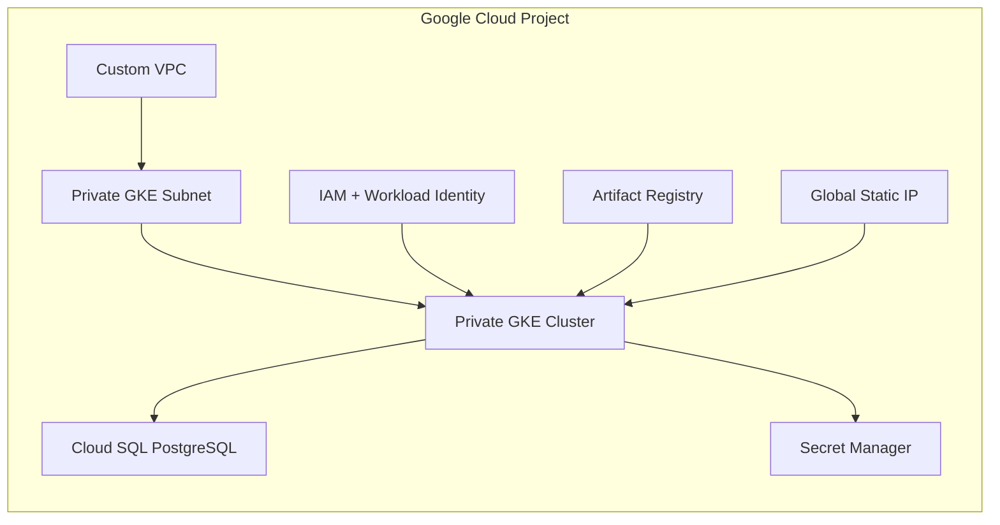
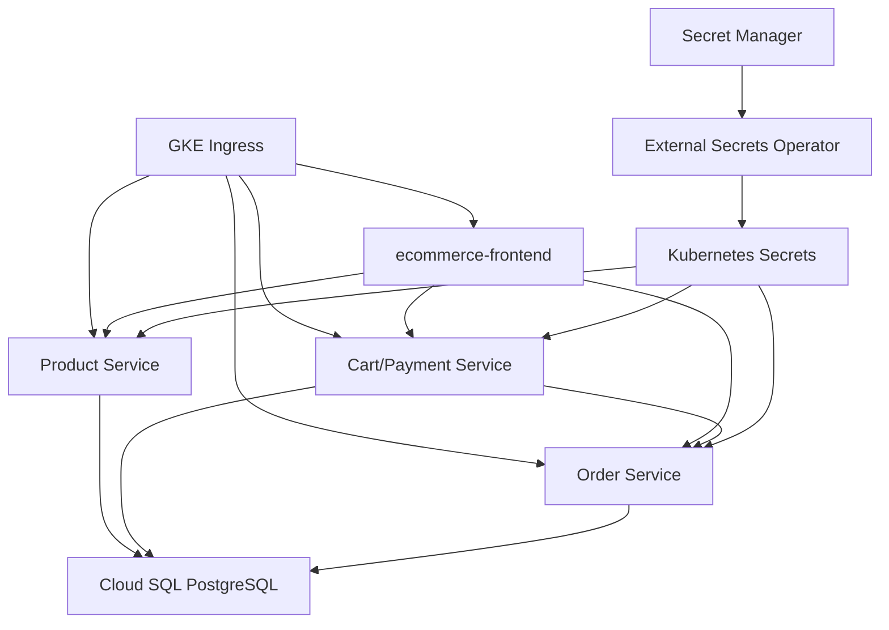
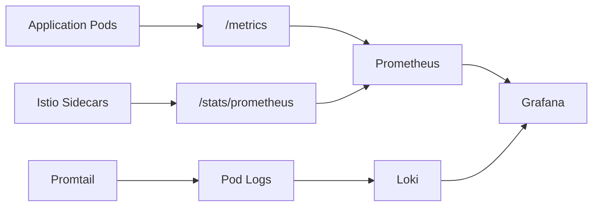

# Architecture

This project is designed as a realistic DevOps Golden Path: application teams push service code, CI builds and publishes images, and ArgoCD reconciles the desired deployment state into GKE.

## Design Goals

- Give developers a repeatable path from source code to production-like Kubernetes runtime.
- Keep infrastructure ownership in a platform repository.
- Avoid long-lived cloud credentials in GitHub.
- Use managed GCP services where they reduce operational burden.
- Keep local development simple while still showing production patterns.

## Repository Model

```text
gcp-golden-path-platform       platform, Terraform, Helm, ArgoCD, observability
ecommerce-product-service          Product Service source and CI
ecommerce-frontend           React frontend source and CI
cart-payment-service         Cart and payment source and CI
order-service                Order source and CI
```

This split is intentional. App teams own app code and release pipelines. Platform owners own cloud infrastructure, cluster add-ons, shared policies, and deployment templates.

## Cloud Architecture



### Network Ranges

Terraform defines the GKE network ranges in `terraform/modules/network/main.tf`:

| Purpose | CIDR |
| --- | --- |
| Node subnet | `10.10.0.0/20` |
| Pod secondary range | `10.20.0.0/16` |
| Service secondary range | `10.30.0.0/20` |

These ranges are used by NetworkPolicies for DNS, health checks, and service mesh traffic.

## Kubernetes Runtime



Each service has:

- Deployment
- Service
- ServiceAccount
- ExternalSecret
- HPA
- NetworkPolicy
- ServiceMonitor
- BackendConfig where exposed through GKE ingress

## GitOps Flow

1. Developer pushes code to an app repo.
2. GitHub Actions runs tests.
3. GitHub Actions builds and scans the container image.
4. The image is pushed to Artifact Registry using Workload Identity Federation.
5. CI updates the image tag in this deploy repo.
6. ArgoCD detects the Git change and syncs the Helm chart.
7. GKE rolls out the new pod version.

## Identity And Secrets

GitHub Actions does not use a JSON service account key. It exchanges GitHub OIDC identity through a Workload Identity Pool Provider and impersonates a limited deployer service account.

In-cluster applications use Kubernetes service accounts annotated with:

```text
iam.gke.io/gcp-service-account
```

External Secrets Operator reads the database password from Google Secret Manager and creates Kubernetes secrets for workloads. The app manifests never contain database credentials.

## Traffic Management

The public entry point is currently GKE Ingress with:

- Global static IP
- Google ManagedCertificate
- FrontendConfig HTTP-to-HTTPS redirect
- BackendConfig health checks
- Container-native load balancing through NEGs

Istio is installed for sidecar injection, service mesh telemetry, and future traffic-policy work. The public edge is still GKE Ingress, so external inbound requests may show `connection_security_policy="none"` in Istio metrics. Internal service-to-service traffic is where Istio telemetry and mTLS policies become most valuable.

## Observability



Prometheus scrapes both application metrics and Istio sidecar metrics. Loki stores application logs. Grafana is the single dashboard surface for service health, traffic, latency, and logs.

## Production Hardening Backlog

The current project is a strong showcase/dev foundation. For a real production rollout, the next improvements would be:

- Separate dev, staging, and prod environments.
- Remote Terraform state in GCS with state locking strategy.
- GKE release channels and maintenance windows.
- Binary Authorization or stronger image admission controls.
- Cloud Armor and WAF policy on the public ingress.
- Managed backup and restore runbooks for Cloud SQL.
- SLOs, burn-rate alerts, and paging integration.
- Progressive delivery with Argo Rollouts or Istio traffic shifting.
- Policy-as-code with Gatekeeper or Kyverno.
